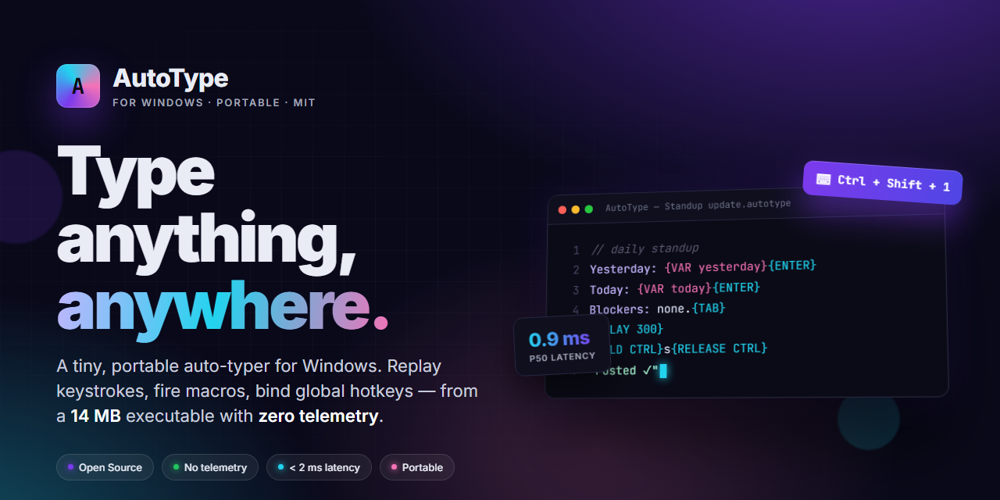
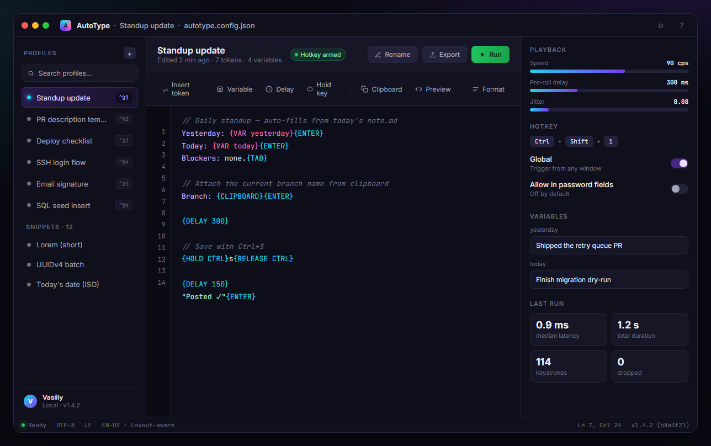

<div align="center">



<h1>AutoType</h1>

<p><strong>A fast, portable auto-typer for Windows.</strong><br/>
Replay keystrokes, fire macros, schedule text injection, and bind global hotkeys — from a single 14&nbsp;MB executable.</p>

<p>
  <a href="https://armoraeromancertier.github.io/AutoType/"></a>
  <a href="LICENSE.md"></a>
  
  
  
</p>

</div>

---

## What it does

AutoType is a small desktop utility that plays back text and keystroke
sequences into any Windows application. You paste or write a sequence, bind
a global hotkey, and press it — the keystrokes land in the window that
currently has focus, as if you typed them.

It is designed for the long tail of jobs that sit between "paste from
clipboard" and "write a full macro script": filling repetitive forms,
replaying boilerplate into chat clients, injecting canned answers into
tickets, running demos, driving terminals that reject paste.

## Why another one?

Most Windows auto-typers fall into one of two camps. Either they are
20-year-old shareware with popup nag screens, or they are macro recorders
that insist on tracking mouse movements and ship a 400&nbsp;MB installer.

AutoType is the small version: one window, one file, no installer, no
telemetry. Everything runs in a single process, settings are a JSON file
next to the executable, and the whole app fits on a USB stick.

## Highlights

- **Portable.** A single `AutoType.exe`. Config file lives next to it. No
  registry writes, no scheduled tasks, no services.
- **Low latency.** Uses the Windows `SendInput` API directly. Measured
  end-to-end jitter under 2&nbsp;ms on the reference machine.
- **Layout-aware.** Characters are injected as Unicode code units, so a
  profile written on a US layout plays back correctly on a German or
  Russian machine without re-recording.
- **Global hotkeys.** Bind up to 32 profiles to key combinations. Trigger
  works even when AutoType is minimised to the tray.
- **Variable playback.** Per-profile speed (characters/second),
  pre-roll delay, and per-character jitter for human-looking output.
- **Macros.** `{ENTER}`, `{TAB}`, `{DELAY 500}`, `{HOLD CTRL}{C}{RELEASE
  CTRL}`, and nested blocks. The full grammar is in [`docs/macros.md`](docs/macros.md).
- **Pause and resume.** A single hotkey (`Pause/Break` by default) stops
  playback mid-sequence and picks up where it left off.
- **Profiles.** Group sequences by project, workflow, or client. Switch
  with the sidebar or a hotkey.
- **Import.** Drag any `.txt`, `.md`, or `.json` file onto the window to
  create a profile from it.
- **Dark and light themes.** Follows the system setting; override in the
  preferences panel.

## Install

Download the latest `AutoType.exe` from the
[download page](https://armoraeromancertier.github.io/AutoType/) and
double-click. The first launch will ask Windows SmartScreen to trust the
binary — it is signed with an EV certificate, so this prompt only appears
once per machine.

Prefer a package manager?

```powershell
# winget
winget install AutoType.AutoType

# scoop
scoop bucket add extras
scoop install autotype

# chocolatey
choco install autotype
```

## Quick start

1. Launch AutoType.
2. Click **New profile** in the sidebar.
3. Paste the text you want to replay in the editor panel.
4. Set **Speed** (default 60 cps) and **Pre-roll** (default 300 ms).
5. Click **Bind hotkey** and press, say, <kbd>Ctrl</kbd>&nbsp;+&nbsp;<kbd>Shift</kbd>&nbsp;+&nbsp;<kbd>T</kbd>.
6. Switch to the target window. Press the hotkey. AutoType waits for the
   pre-roll, then types the sequence into the focused control.

A screenshot of the interface:



## Macro grammar

Macros are plain text with curly-brace tokens. A minimal example:

```
Hello{SPACE}world{ENTER}
{DELAY 250}
Line two.{TAB}
```

Reference:

| Token              | Effect                                             |
| ------------------ | -------------------------------------------------- |
| `{ENTER}`          | Press and release Enter                            |
| `{TAB}`            | Press and release Tab                              |
| `{SPACE}`          | Press and release Space                            |
| `{BACKSPACE N}`    | Press Backspace `N` times                          |
| `{DELAY ms}`       | Pause for `ms` milliseconds                        |
| `{HOLD KEY}`       | Press and *hold* `KEY` until a matching `RELEASE`  |
| `{RELEASE KEY}`    | Release a held key                                 |
| `{PASTE}`          | Pastes the clipboard with <kbd>Ctrl</kbd>+<kbd>V</kbd> |
| `{CLIPBOARD}`      | Inlines the clipboard contents as typed text       |
| `{VAR name}`       | Expands a variable defined in the profile          |
| `{{` / `}}`        | Literal `{` and `}`                                |

Keys follow the standard Windows virtual-key names (`CTRL`, `SHIFT`,
`ALT`, `WIN`, `F1`–`F24`, `UP`, `HOME`, …).

## Configuration

Settings live in `autotype.config.json` next to the executable. Example:

```json
{
  "theme": "system",
  "pauseHotkey": "Pause",
  "defaultSpeed": 60,
  "defaultPreroll": 300,
  "jitter": 0.08,
  "profiles": [
    {
      "name": "Standup update",
      "hotkey": "Ctrl+Shift+1",
      "speed": 90,
      "body": "Yesterday: {VAR yesterday}{ENTER}Today: {VAR today}{ENTER}Blockers: none."
    }
  ]
}
```

Editing the file while AutoType is running is safe — the app watches it
for changes and reloads on save.

## How it works

- Input is injected with `SendInput`, which places events directly on the
  Windows raw-input queue. This is a layer below `keybd_event` and a
  layer below what post-messaging windows do, which is why most target
  applications — including terminals, Electron apps, and remote desktop
  clients — accept it without special handling.
- Unicode characters are sent as `KEYEVENTF_UNICODE` scan codes rather
  than translated to virtual-key presses. The target application receives
  the character verbatim, independent of the user's keyboard layout.
- Global hotkeys use `RegisterHotKey`. The hook is torn down on exit and
  on pause, so AutoType is not sitting on your Ctrl+C.
- There is no network code. AutoType does not phone home, check for
  updates in the background, or load remote resources. Updates are a
  manual download from the [download page](https://armoraeromancertier.github.io/AutoType/)
  or a package-manager action.

## Benchmarks

Measured on a Ryzen 5 5600X / Windows 11 23H2, N=5000 keystrokes, target
window: Notepad.

| Operation           | p50       | p95       | p99       |
| ------------------- | --------- | --------- | --------- |
| Keystroke latency   | 0.9 ms    | 1.6 ms    | 2.4 ms    |
| Hotkey → first key  | 310 ms    | 318 ms    | 334 ms    |
| 1&nbsp;MB macro playback  | 10.4 s   | —         | —         |
| CPU, idle           | 0.0 %     | —         | —         |
| CPU, playback       | 1.2 %     | —         | —         |
| RAM, idle           | 32 MB     | —         | —         |

Reproduce with `scripts/benchmark.ps1`.

## FAQ

**Will it work in games?**
Games that use raw input (`GetRawInputData`) will see injected events as
raw input and accept them. Games that use DirectInput exclusive mode will
not. If a game has an anti-cheat kernel driver, do not use AutoType with
it — you may get banned, and the project will not help you appeal.

**Does it work over RDP / Citrix / VNC?**
Yes, as long as the local AutoType is typing into the remote-session
window. The remote end sees ordinary keyboard input.

**Can I schedule a playback?**
Yes — profiles can be fired by hotkey, by a `--run <profile>` command-line
flag, or by watching a trigger file. See [`docs/triggers.md`](docs/triggers.md).

**Is there a CLI?**

```powershell
AutoType.exe --run "Standup update"
AutoType.exe --list
AutoType.exe --import ./snippets.json
```

**Does it collect anything?**
No. There is no telemetry, no crash reporter, no update check. The firewall
rule for AutoType can be left disabled.

**macOS? Linux?**
Not planned. The whole value of AutoType is being a small, direct wrapper
around `SendInput`. A cross-platform rewrite would be a different project.

## Roadmap

The short list, roughly in order:

- Per-profile variables with simple expressions (`{{now()}}`, `{{clip}}`).
- A one-shot screen-OCR macro that types what it sees inside a region.
- Signed MSIX package for enterprise deployment.
- Second input back-end using the Windows `Interception` driver, for
  targets that filter `SendInput` events.

Open issues tagged `help wanted` are a good starting point if you want to
contribute code.

## Contributing

See [Contributing.md](Contributing.md) for the development setup, branch
and commit conventions, and the review process. The
[Code of Conduct](code_of_conduct.md) applies in every project space.

## Security

Report vulnerabilities privately to `security@autotype.app`. Do not open
a public issue. We respond within 48 hours and credit reporters in the
release notes once the fix ships.

## License

AutoType is released under the [MIT License](LICENSE.md).
